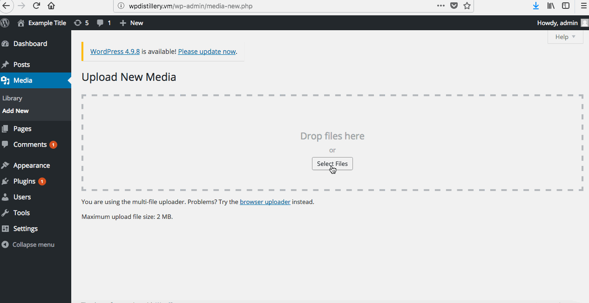
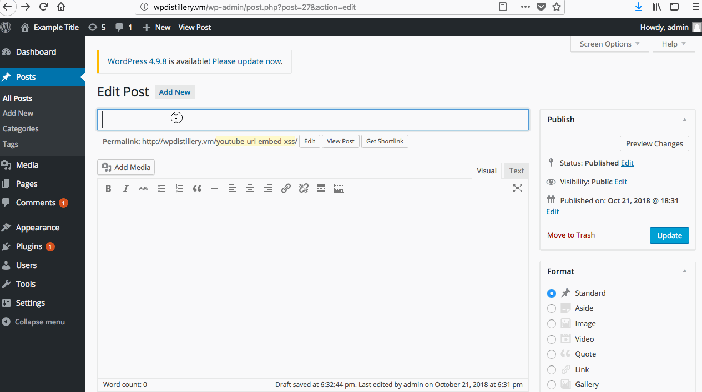

# WordPress-Pen-Testing-Lab

# Exploit 1
WordPress 3.6.0-4.7.2 - Authenticated Cross-Site Scripting (XSS) via Media File Metadata (CVE-2017-6814)

Reference: https://sumofpwn.nl/advisory/2016/wordpress_audio_playlist_functionality_is_affected_by_cross_site_scripting.html

To exploit this vulnerability, I used the following steps:
  1. Download an arbitrary MP3 file. (I prefer something by Rick Astley)
  2. In order to make our newly downloaded file malicious, we must edit the metadata of the file.
  3. I used the software 'kid3' to change the title of the song in the file metadata to include my XSS code.
  4. Log into the vicitm WordPress page as an Administrator (important to have access to unfiltereds_html. See the reference for more details) and upload this malicious file.
  5. Once the file is uploaded, all it takes is viewing file to execute the Stored-XSS.
  
This vulnerability is present in WordPress Versions 3.6.0-4.7.2. The vulnerability has been patched in versions 4.7.3 and later.

# Exploit 2
WordPress  4.0-4.7.2 - Authenticated Stored Cross-Site Scripting (XSS) in YouTube URL Embeds

Reference: https://blog.sucuri.net/2017/03/stored-xss-in-wordpress-core.html

To exploit this vulnerability, I used the following steps:
  1. Login to the Administrator account of the victim WordPress page.
  2. Create a new post.
  3. In the body of the new post insert the malicious YouTube embedding.
  4. View the post and execute your newly created Stored-XSS.
  
This vulnerability is present in WordPress Versions 4.0-4.7.2. The vulnerability has been patched in versions 4.7.3 and later.
